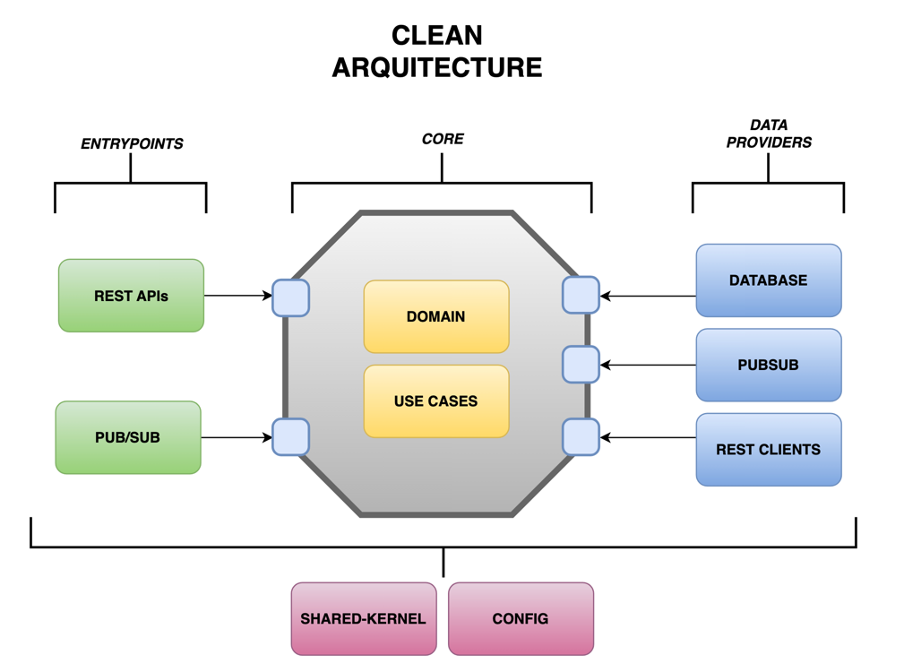
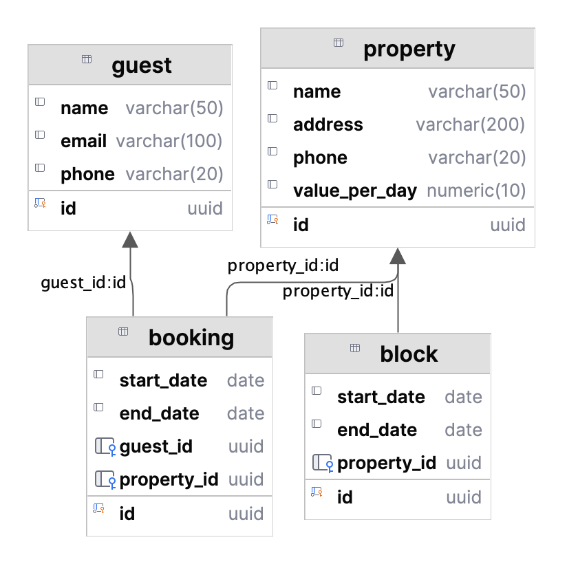

# Test Overview Implementation

This document explains the architectural pattern described in the provided test. The pattern is designed to facilitate the implementation of services that emphasize reusability, maintainable code, technology independence, and testability. It also aligns with the principles of SOLID.

***IMPORTANT: The purpose of the architectural choice is didactic to demonstrate the application of best practices***

Architectural Overview
The architecture follows a simplified approach with a strong emphasis on isolating the core functionality while providing a single external layer for the application. This approach mimics a physical modular division using packages that include configuration, entry points, and data providers.

By adhering to these architectural principles, this pattern ensures that your codebase is well-structured, maintainable, and adaptable to changes, ultimately leading to a more robust and testable system.

Please refer to the included architecture image for a visual representation of the pattern.

### Arch approach


### MER Database


### API documentation
[Swagger/OpenAPI] http://localhost:8080/api/swagger-ui/index.html
#### Colletion postman: 
## 🔧 Tools:

* Java 17
* Gradle
* Mapstruct
* H2 database
* Openapi/Swagger

## 📋 Setting up your development environment

### 📋 Prerequisites

Some prerequisites for you to upload the environment locally.

* Download and install [JDK 17](https://adoptium.net/temurin/releases/)
* Download your preferred IDE

### 🔧 Environment Configuration

Start by cloning this project

```
git clone git@bitbucket.org:valid-sa/<project>.git

